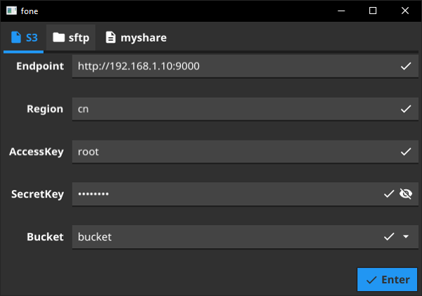
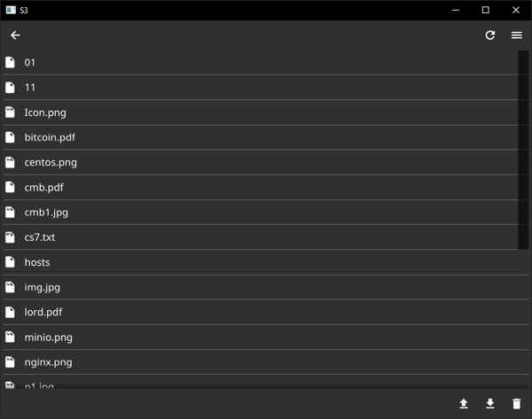
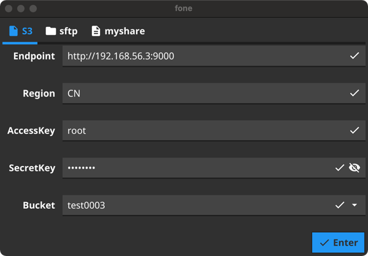
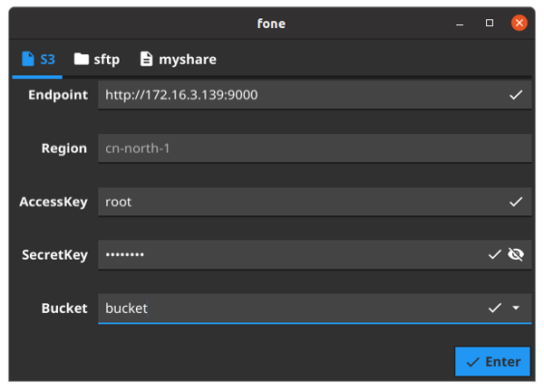

# fone
fone is a simple S3/sftp Browser based on [fyne](https://github.com/fyne-io/fyne)

# Install
- Download prebuild [binary](https://github.com/shvc/fone/releases)
- Or build from source
```
git clone https://github.com/shvc/fone

go install github.com/fyne-io/fyne-cross

fyne-cross windows -env GOPROXY=https://goproxy.cn
fyne-cross linux -release -env GOPROXY=https://goproxy.cn
fyne-cross android -release -env GOPROXY=https://goproxy.cn
```

# Set Font to resolv garbled issue
- MacOS Font ENV
```
export FYNE_FONT='/System/Library/Fonts/STHeiti Light.ttc'
```
- Windows Font ENV
```
FYNE_FONT=C:\Windows\Fonts\Microsoft YaHei Mono.ttf
```

- Linux Font ENV
```
FYNE_FONT='/usr/share/fonts/opentype/noto/NotoSerifCJK-Regular.ttc'
```

## ScreenShot
- Windows login  

- Windows File Browser  

- MacOS login  

- Ubuntu login  

